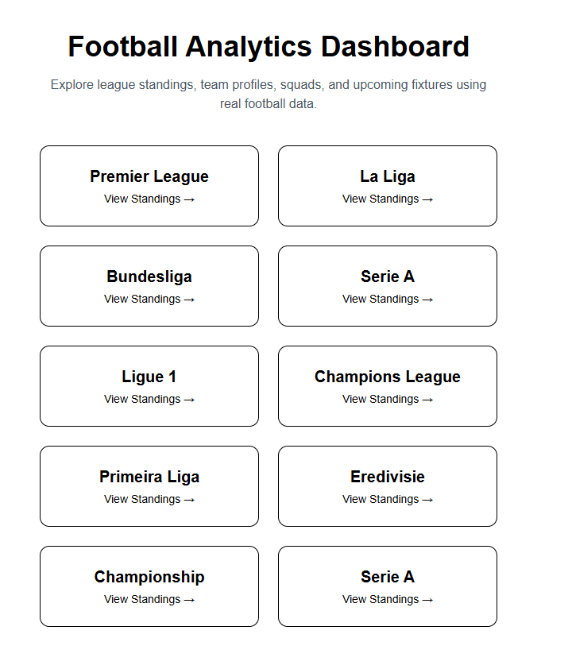
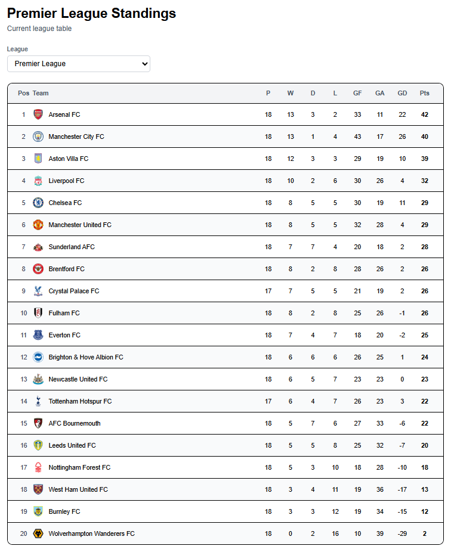
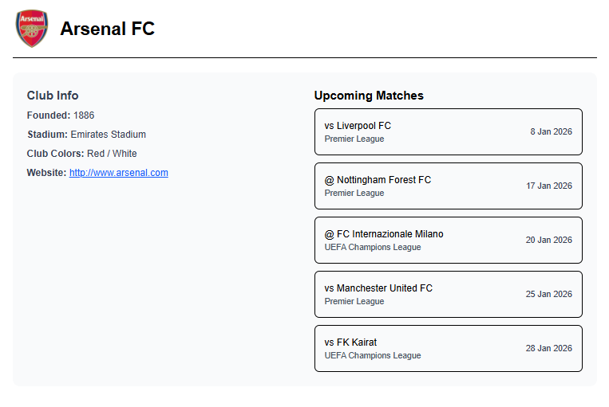
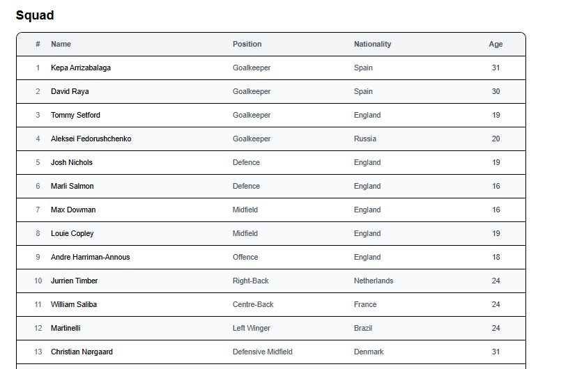
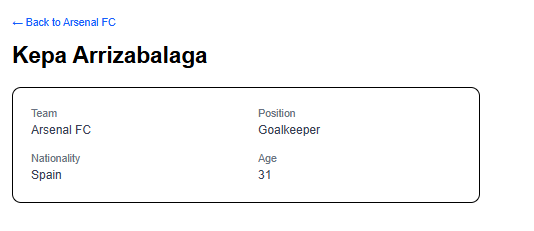

# Football Analytics Hub

Football Analytics Hub is a web application for exploring football league data across multiple competitions. The application provides league standings, team information, squad lists, player profiles, and upcoming fixtures using real-world football data.

The app uses the **Football-Data.org free API tier** and is built to respect its limitations while still offering a clear and consistent browsing experience.

---

## Overview

Football Analytics Hub allows users to explore football data across **multiple leagues and competitions** through a structured and navigable interface.

Users can:
- Browse league standings from different competitions
- Navigate from a league to a team and further to individual players
- View team details including squad lists and upcoming matches
- Access player profile pages with calculated age data

The application emphasizes **server-side rendering**, **data caching**, and **defensive handling of incomplete API responses**, reflecting real-world API constraints.

---

## Supported Competitions

The application currently supports standings and team data for multiple leagues, including for example:
- Premier League
- La Liga
- Bundesliga
- Serie A
- Ligue 1
- Primeira Liga
- Eredivisie
- Championship
- UEFA Champions League
- Additional supported competitions available via the API

Competition availability depends on the Football-Data.org free tier.

---

## Features

- League standings across multiple competitions
- Team detail pages including:
  - Club information
  - Upcoming fixtures
  - Squad lists with calculated player ages
- Individual player profile pages
- Context-aware navigation (league → team → player)
- Server-side data fetching using Next.js App Router
- API response caching using ISR (`revalidate`)
- Secure API key handling with environment variables
- Clean, responsive UI designed for desktop-first usage

---

## Screenshots

Below are selected screenshots highlighting the main user flows and data views of the application:

- League selection and dashboard
- League standings table
- Team pages with club info and upcoming fixtures
- Squad lists and player profile pages

(See the `screenshots/` directory for full-resolution images.)

## Screenshots

### Dashboard & League Selection
| Home |
|------|
|  |

### League Standings
| League Table |
|--------------|
|  |

### Team Pages
| Club Info & Upcoming Matches | Squad List |
|-----------------------------|------------|
|  |  |

### Player Profiles
| Player Details |
|----------------|
|  |


---

## Tech Stack

- **Next.js 14 (App Router)**
- **TypeScript**
- **Tailwind CSS**
- **Football-Data.org API (Free Tier)**
- Optional deployment: **Vercel**

---

## API Usage Notes

This project intentionally uses the **Football-Data.org free tier**.

As a result:
- Player statistics are limited
- Shirt numbers are not available
- No live match data is included
- No advanced analytics (e.g. xG, assists)

The UI is designed to **gracefully handle missing or partial data**, ensuring stable rendering even when API responses are incomplete.

---

## Setup

### 1. Install dependencies

```bash
npm install
```

### 2. Environment variables

Create a `.env.local` file:

```env
FOOTBALL_DATA_API_KEY=your_api_key_here
```

### 3. Run locally

```bash
npm run dev
```

Open [http://localhost:3000](http://localhost:3000)

> Deployment (e.g. Vercel) can be added later when needed.
